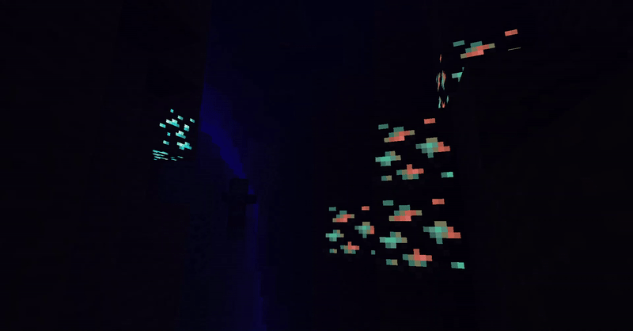

# MoreMcmeta Emissive Textures Plugin

Plugin for MoreMcmeta to enable emissive textures for blocks, items, entities, and block entities.

## Are You in the Right Place?
If you're here to make a suggestion or bug report, find out how the emissive plugin works, or contribute to its development, you're in the right place!

If you're looking to download the plugin or find out more about it, check out the [CurseForge page](https://www.curseforge.com/minecraft/mc-mods/moremcmeta-emissive-fabric).